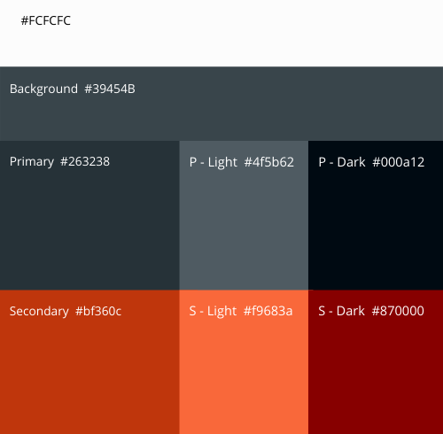
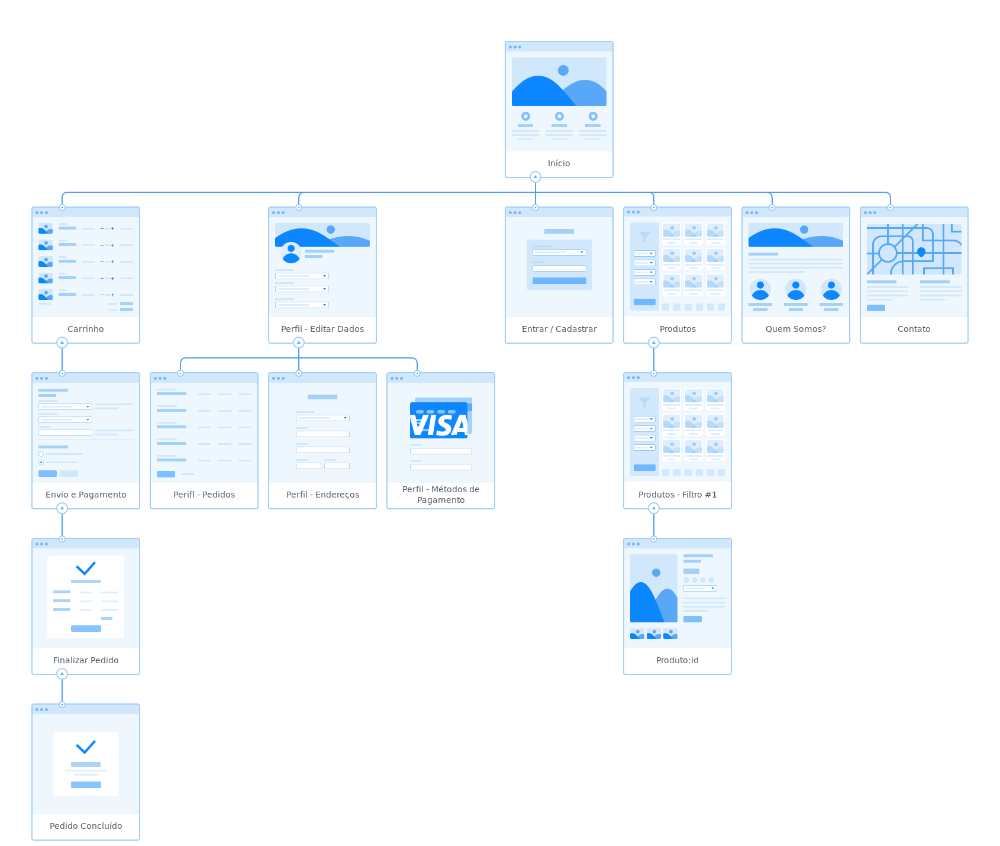
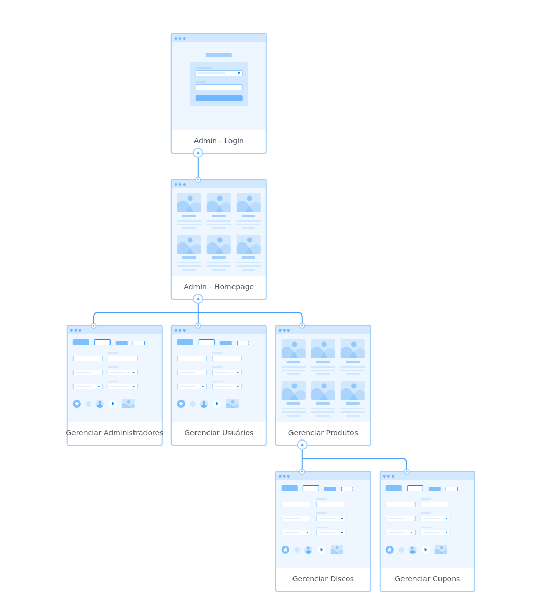
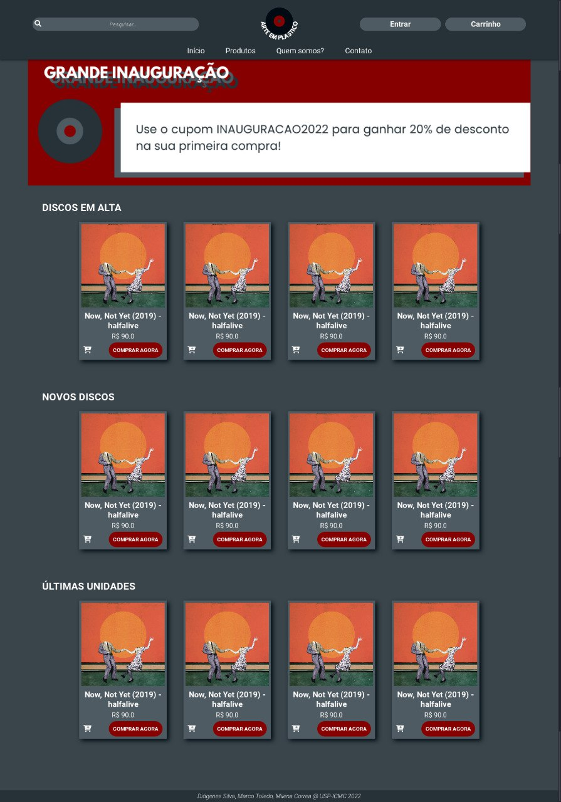
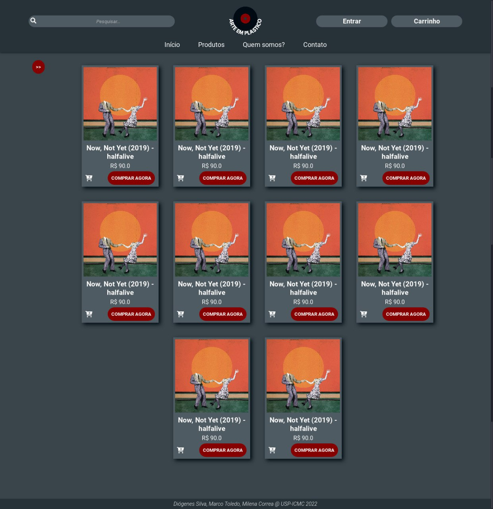
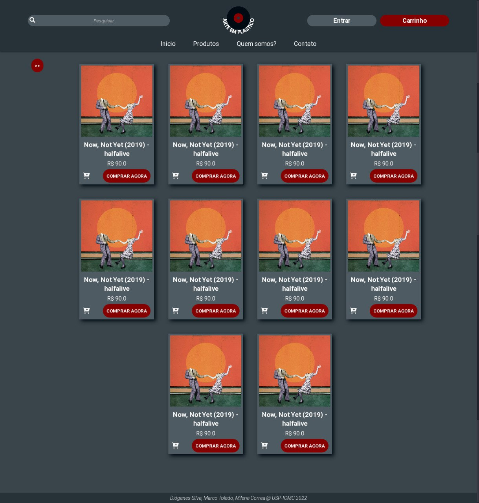
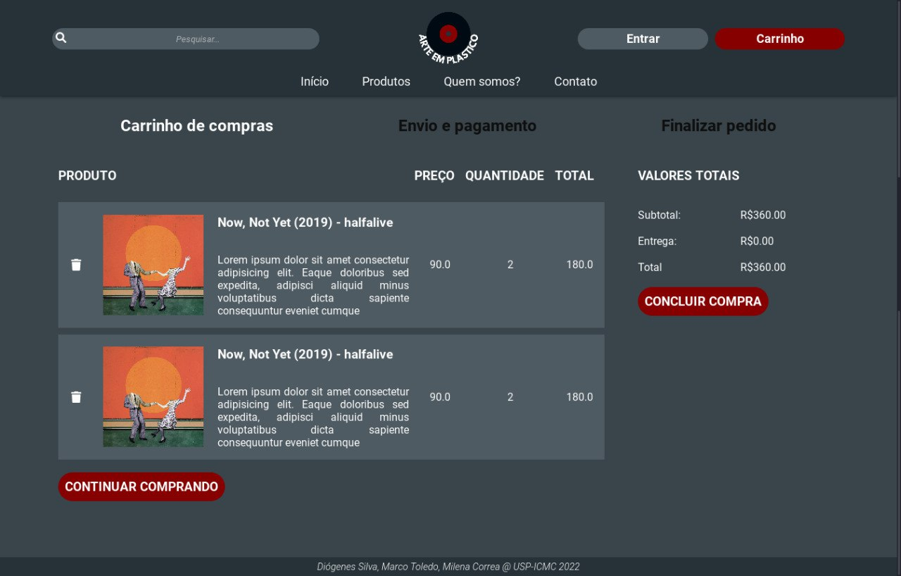

# Arte Em Plástico


## Sumário
[Participantes](#participantes)\
[Figma](#projeto-no-figma)\
[Requisitos do Sistema](#requisitos-do-sistema)\
[Descrição do Projeto](#descrição-do-projeto)\
[Comentários Sobre o código](#comentários-sobre-o-código)\
[Testes Automatizados](#testes-automatizados)\
[Resultados dos Testes](#resultados-dos-testes)\
[Executando o código](#executando-o-código)\
[Problemas](#problemas)\
[Comentários](#comentários)


## Participantes
<a href="https://github.com/DioPedro"></a>
<a href="https://github.com/Ocramoi"></a>
<a href="https://github.com/milenacsilva"></a>

Diógenes Silva Pedro - **11883476**\
Marco Antônio Ribeiro de Toledo - **11796419**\
Milena Corrêa da Silva - **11795401**

## Projeto no Figma
### [Protótipo com Navegação](https://www.figma.com/proto/RAqfw8Wfo1lq22mlEtHWMf/Trabalho-Web?node-id=0%3A1&scaling=scale-down&page-id=0%3A1&starting-point-node-id=57%3A428&show-proto-sidebar=1)

### [MockUp das Páginas](https://www.figma.com/file/RAqfw8Wfo1lq22mlEtHWMf/Trabalho-Web?node-id=0%3A1)

## Requisitos do sistema
### Descrição Geral 
* O sistema trabalha com a venda de discos de vinis importados e nacionais.
* O sistema possui dois tipos de usuários: Clientes e Admnistradores.
    * Os admnistradores são aqueles responsáveis por gerenciar clientes, produtos e outros admnistradores.
    * Os clientes são as pessoas que compraram os discos.
    * A aplicação já vem com uma conta padrão de administrador com ``` login: admin; senha: admin```.
* O sistema utiliza a lógica tradicional de "carrinhos" para realizar as vendas.
    * O usuário logado pode adicionar/remover itens do carrinho.
    * A compra pode ser concluída após o cliente confirmar/adicionar o endereço de entrega e o método de pagamento (cartão, boleto ou pix).
    * O carrinho é esvaziado quando uma compra é concluída.

### Registros de Dados
* **Admnistradores**: id, nome, telefone e um cadastro (email e senha). 
* **Clientes**: id, nome, telefone, um cadastro (email e senha), uma lista de endereços de entrega (inicialmente vazia), uma lista de cartões (inicialmente vazia) e uma lista de pedidos (inicialmente vazia).
* **Produtos (Discos de Vinil)**: id, título, capa, descrição (curta e detalhada), data de lançamento, artistas, gêneros, informações adicionais sobre o disco físico, preço, quantidade em estoque e quantidade vendida.
* **Cupons**: id, id do usuário, id do disco, porcentagem do desconto.

### Funcionalidade Extra 
* Uma vez por dia, o usuário tem direito a um cupom de desconto em um albúm aleatório, encorajando-o a expandir seu gosto musical.

### Requisitos Não Funcionais
*  O sistema deve ser responsivo e possuir boa usabilidade.

## Descrição do projeto

### Funcionalidades do sistema
* Os administradores podem catalogar/gerenciar os produtos e usuários do sistema de maneira fácil e prática.
* Tanto clientes como visitantes (usuários não cadastrados) podem visualizar a listagem de produtos do site, pesquisar produtos e utilizar filtros.
* Visitantes podem se cadastrar no site, tornando-se clientes.
* A cada dia, clientes tem direito a ganhar desconto em algum disco aleatório.
* Clientes podem acessar e editar sua conta e informações nela contidas, como endereços e dados de cadastro.
* Clientes podem adicionar/remover itens ao carrinho de compras, adicionar/confirmar o endereço de entrega e o metódo de pagamento e, por fim, concluir o pedido.
* Clientes podem acompanhar seu histórico de pedidos.
* A página de cada disco possui uma uma secção que sugere itens similares.

### Informações a serem salvas no servidor
* Os registros de dados dos clientes, administradores, produtos e cupons.

### Estética
Para garantir uma boa experiência de usuário, tentamos utilizar os princípios definidos pelo [Material](https://material.io/design/introduction#principles).

##### Paleta de Cores


### Diagrama de Navegação
Para uma melhor expêriencia de usuário, decidimos separar as páginas de administrador das demais. Assim, o admin consegue acessa-las pelo link `localhost:8080/admin` sem ter âncora com as páginas principais, ou seja, sem que essa página apareça para usuários comuns (visitantes e clientes). 


 
### Screenshots - Telas Implementadas
#### Início


#### Listagem de Produtos



#### Carrinho


## Comentários sobre o código
Foi utilizada o padrão do Vue, com uma pasta para components, uma para views, uma para css globais, uma para assets, etc. 

Além disso em cada arquivo `.vue` o css é scoped, ou seja, ele só é aplicado nos elementos da página ou componente.

Foi usado localStorage para simular o funcionamento do backend. Além de um arquivo de dados, ao invés dos dados do banco.

*Component FlexTable*

## Testes Automatizados
Algumas funcionalidades foram implementadas para testar o funcionamento do site, antes do desenvolvimento do backend. Para a simulação das funcionalidades foram implementadas:
- Cadastro de conta
- Login (usuário e admin)
- Logout
- Operações no carrinho (adição e remoção de discos)
- Compra
- Adicionar mêtodos de pagamento e novos endereços no perfil do usuário
- Filtro pro gênero, preço e nome do artista (funcionaidade extra).
- Sugestão de discos (funcionalidade extra).
- Operações dos admins (adição, edição e remoção de admins e produtos, além de remoção de usuários)

Para testar as funcionalidades temos:
1. Compra:
    
    O usuário pode adicionar e remover produtos do carrinho. Os produtos podem ser adicionados pela página inicial, pela página de produtos ou pela página de um produto específico.

    O filtro está implementado na página de produto e é aplicado automaticamente.
    
2. Admin:

    Ao entrar na página de admin o usuário precisa ter a permissão necessária para poder logar. (Temos no arquivo user.js dentro de src/store/modules um usuário admin que pode logar na página para poder fazer os testes)

    Ao logar ele pode acessar as páginas de produto, admins e usuários. Nessas temos um menu responsivo para adição, edição e remoção de produtos, admins ou usuários.

3. Novas informações para o usuário

    Entrando na página do perfil do usuário o mesmo pode adicionar novos cartões como mêtodo de pagamento, além de poder adicionar novos endereços para entrega.

## Resultados dos Testes
Pelos testes realizados, temos um bom funcionamento em todos os casos. Espera-se poucos problemas durante a integração com o servidor.

## Executando o código
Para você poder executar o código é necessário 
que a máquina tenha o npm e o `yarn` instalado.

Caso você ainda não os tenha siga esse [tutorial](https://classic.yarnpkg.com/lang/en/docs/install/#debian-stable)

Após a instalação do yarn, para instalar os pacotes necessários basta executar:
```
yarn install
```

Para compilar o código e ter o hot-reload para desenvolvimento:
```
yarn serve
```

Para compilar para produção:
```
yarn build
```

## Problemas
Como foi solicitado um teste das funcionalidades sem a utilização do servidor em si, estamos usando local storage. Dado isso ao adicionarmos novos admins eles serão adicionados, porém não é possível logar com esses admins. O mesmo se acontece com o usuário, onde é possível a criação porém não é possível logar.

Esses problemas ocorrem devido ao uso do local storage, quando for implementado o servidor, esses problemas não serão mantidos.

## Comentários
*None*

## Timeline
- **release/v2.1.0**: Entrega do *Milestone 2*, 27/06/2022
